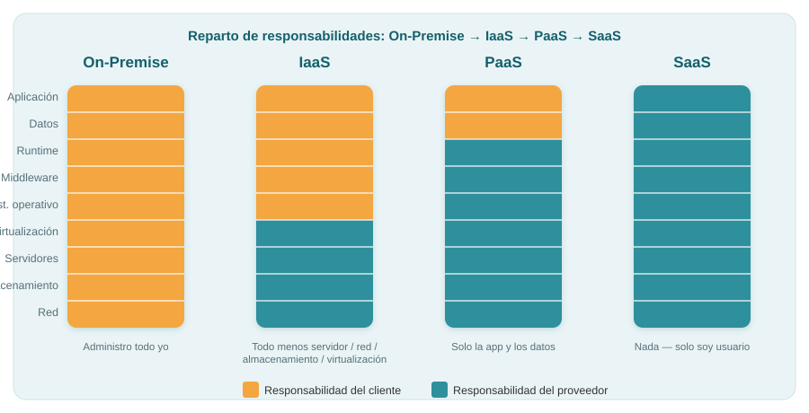
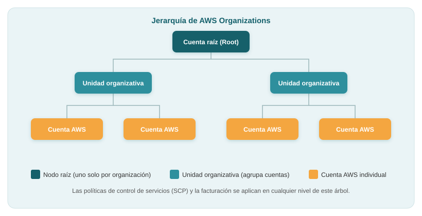
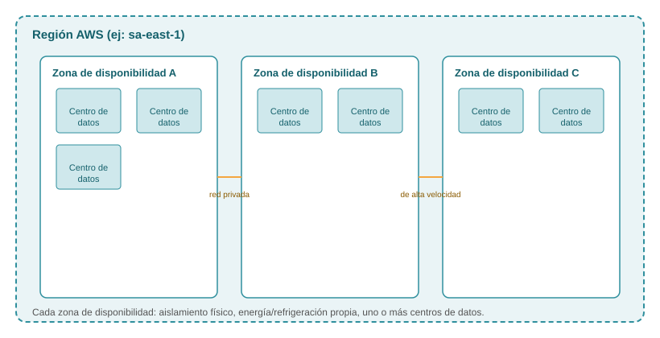

# Desarrollo e Implementación de Sistemas en la Nube — Biblioteca de Conceptos

Apuntes de referencia de la materia **Desarrollo e Implementación de Sistemas en la Nube**, IFTS N°11. Profesor: Emilio Dorion.

> Este archivo se organiza por concepto, no por orden cronológico de clases. El orden real en que se dio cada tema queda registrado en `bitacora.md` y en el historial de commits. La división real de la cátedra es por **Unidad**.

## Índice

- [Desarrollo e Implementación de Sistemas en la Nube — Biblioteca de Conceptos](#desarrollo-e-implementación-de-sistemas-en-la-nube--biblioteca-de-conceptos)
  - [Índice](#índice)
  - [Unidad 1 — Introducción a la computación en la nube](#unidad-1--introducción-a-la-computación-en-la-nube)
    - [1. ¿Qué es la nube?](#1-qué-es-la-nube)
    - [2. Origen y evolución histórica de la nube](#2-origen-y-evolución-histórica-de-la-nube)
      - [2.1 La idea original (décadas de 1960-1970)](#21-la-idea-original-décadas-de-1960-1970)
      - [2.2 Mainframes y nubes privadas](#22-mainframes-y-nubes-privadas)
      - [2.3 El nacimiento de la nube pública: AWS (2006)](#23-el-nacimiento-de-la-nube-pública-aws-2006)
      - [2.4 Panorama actual de proveedores](#24-panorama-actual-de-proveedores)
    - [3. Modelos de servicio en la nube: IaaS, PaaS y SaaS](#3-modelos-de-servicio-en-la-nube-iaas-paas-y-saas)
      - [3.1 IaaS — Infrastructure as a Service](#31-iaas--infrastructure-as-a-service)
      - [3.2 PaaS — Platform as a Service](#32-paas--platform-as-a-service)
      - [3.3 SaaS — Software as a Service](#33-saas--software-as-a-service)
      - [3.4 Comparación de responsabilidades entre modelos](#34-comparación-de-responsabilidades-entre-modelos)
    - [4. Tipos de nube: privada, pública e híbrida](#4-tipos-de-nube-privada-pública-e-híbrida)
    - [5. Comparación entre AWS y la infraestructura tradicional](#5-comparación-entre-aws-y-la-infraestructura-tradicional)
    - [6. Beneficios de la computación en la nube](#6-beneficios-de-la-computación-en-la-nube)
      - [6.1 Pago por uso (Pay-as-you-go)](#61-pago-por-uso-pay-as-you-go)
      - [6.2 Elasticidad y escalabilidad](#62-elasticidad-y-escalabilidad)
      - [6.3 Alta disponibilidad y distribución en regiones](#63-alta-disponibilidad-y-distribución-en-regiones)
      - [6.4 Eficiencia y time to market](#64-eficiencia-y-time-to-market)
      - [6.5 Acceso a tecnología reciente](#65-acceso-a-tecnología-reciente)
    - [7. DevOps (mención introductoria)](#7-devops-mención-introductoria)
  - [Unidad 3 — Facturación y economía de la nube](#unidad-3--facturación-y-economía-de-la-nube)
    - [1. Modelo de precios de AWS](#1-modelo-de-precios-de-aws)
    - [2. Formas de pago](#2-formas-de-pago)
      - [2.1 Pagar por lo que se utiliza (bajo demanda)](#21-pagar-por-lo-que-se-utiliza-bajo-demanda)
      - [2.2 Pagar menos al reservar (instancias reservadas)](#22-pagar-menos-al-reservar-instancias-reservadas)
      - [2.3 Pagar menos si se usa más (descuento por volumen)](#23-pagar-menos-si-se-usa-más-descuento-por-volumen)
      - [2.4 Pagar aún menos a medida que AWS crece](#24-pagar-aún-menos-a-medida-que-aws-crece)
      - [2.5 Precios personalizados](#25-precios-personalizados)
    - [3. Servicios sin cargo](#3-servicios-sin-cargo)
    - [4. Costo total de propiedad (TCO)](#4-costo-total-de-propiedad-tco)
    - [5. AWS Organizations y facturación unificada](#5-aws-organizations-y-facturación-unificada)
    - [6. Panel y herramientas de facturación](#6-panel-y-herramientas-de-facturación)
    - [7. Soporte técnico (AWS Support)](#7-soporte-técnico-aws-support)
  - [Unidad 4 — Infraestructura global de AWS](#unidad-4--infraestructura-global-de-aws)
    - [1. Regiones](#1-regiones)
    - [2. Zonas de disponibilidad](#2-zonas-de-disponibilidad)
    - [3. Centros de datos](#3-centros-de-datos)
    - [4. Puntos de presencia (edge locations)](#4-puntos-de-presencia-edge-locations)
    - [5. Características de la infraestructura de AWS](#5-características-de-la-infraestructura-de-aws)
    - [6. Categorías de servicios de AWS](#6-categorías-de-servicios-de-aws)
      - [6.1 Almacenamiento](#61-almacenamiento)
      - [6.2 Cómputo / informática](#62-cómputo--informática)
      - [6.3 Bases de datos](#63-bases-de-datos)
      - [6.4 Redes y entrega de contenido](#64-redes-y-entrega-de-contenido)
      - [6.5 Seguridad, identidad y conformidad](#65-seguridad-identidad-y-conformidad)
      - [6.6 Administración y gobernanza](#66-administración-y-gobernanza)
  - [Unidad 5 — Seguridad](#unidad-5--seguridad)
    - [1. Modelo de responsabilidad compartida (en detalle)](#1-modelo-de-responsabilidad-compartida-en-detalle)
    - [2. AWS IAM (Identity and Access Management)](#2-aws-iam-identity-and-access-management)
      - [2.1 Recursos, identidades y el trío quién/qué/cómo](#21-recursos-identidades-y-el-trío-quiénquécómo)
      - [2.2 Usuarios, grupos, políticas y roles](#22-usuarios-grupos-políticas-y-roles)
      - [2.3 Lógica de allow/deny](#23-lógica-de-allowdeny)
      - [2.4 Roles entre servicios (sin usuario ni contraseña)](#24-roles-entre-servicios-sin-usuario-ni-contraseña)
    - [3. Cifrado de datos](#3-cifrado-de-datos)
      - [3.1 Cifrado en reposo](#31-cifrado-en-reposo)
      - [3.2 Cifrado en tránsito](#32-cifrado-en-tránsito)
    - [4. MFA (autenticación multifactor)](#4-mfa-autenticación-multifactor)
  - [Unidad 6 — Redes](#unidad-6--redes)
    - [1. Conceptos base de redes](#1-conceptos-base-de-redes)
    - [2. Amazon VPC (Virtual Private Cloud)](#2-amazon-vpc-virtual-private-cloud)
    - [3. VPC, subredes y zonas de disponibilidad](#3-vpc-subredes-y-zonas-de-disponibilidad)
    - [4. Alta disponibilidad con subredes en múltiples AZ](#4-alta-disponibilidad-con-subredes-en-múltiples-az)
    - [5. Direcciones IP pública vs. IP elástica](#5-direcciones-ip-pública-vs-ip-elástica)
    - [6. Tablas de enrutamiento](#6-tablas-de-enrutamiento)
    - [7. Internet Gateway (IGW)](#7-internet-gateway-igw)
    - [8. Subredes públicas y privadas (en detalle)](#8-subredes-públicas-y-privadas-en-detalle)
    - [9. NAT Gateway](#9-nat-gateway)
    - [10. Interconexión entre VPC](#10-interconexión-entre-vpc)
    - [11. Grupos de seguridad (Security Groups)](#11-grupos-de-seguridad-security-groups)
    - [12. Listas de control de acceso a la red (NACL)](#12-listas-de-control-de-acceso-a-la-red-nacl)
    - [13. Cierre y próximos pasos](#13-cierre-y-próximos-pasos)

---

## Unidad 1 — Introducción a la computación en la nube

### 1. ¿Qué es la nube?

La **nube** (*cloud computing*) es un modelo tecnológico que permite el acceso a recursos de cómputo (procesamiento, almacenamiento, redes, bases de datos, servicios de IA, etc.) a través de internet, sin que el usuario tenga que poseer ni administrar físicamente la infraestructura que los provee.

La idea central es que la infraestructura (hardware, software y red) está **virtualmente integrada**: para quien la usa es algo abstracto, no la toca ni la ve físicamente. Esto es distinto de tener una computadora o un servidor propio en casa o en la empresa, donde uno mismo compra, instala y mantiene el hardware.

Un segundo rasgo definitorio, más comercial que técnico, es la **entrega bajo demanda de potencia de cómputo**: en lugar de comprar hardware por adelantado y pagarlo esté o no en uso, se contrata la capacidad que se necesita en el momento en que se necesita, y se paga en función de eso (ver [Pago por uso](#61-pago-por-uso-pay-as-you-go)).

Esto tiene una consecuencia importante a nivel de negocio: la computación pasa de ser un **activo** que las empresas deben comprar y amortizar (servidores, licencias, hardware) a ser un **servicio** que se contrata y se paga según el consumo real.

### 2. Origen y evolución histórica de la nube

#### 2.1 La idea original (décadas de 1960-1970)

La idea de la computación como un servicio compartido no es nueva. Ya en la década de 1960, cuando internet ni siquiera existía en su forma moderna (recién estaba surgiendo un concepto embrionario de red, de uso exclusivamente militar), el científico **John McCarthy** planteó que en algún momento la informática podría ofrecerse de forma similar a un servicio público a nivel nacional (electricidad, agua, etc.), permitiendo compartir recursos de cómputo entre múltiples usuarios.

*Dato preciso: fue en una charla de 1961 en el MIT.*

#### 2.2 Mainframes y nubes privadas

A partir de la década de 1970 comenzaron a evolucionar los **mainframes**: computadoras de gran porte (ocupaban salas enteras), pensadas para procesar información de forma muy rápida y secuencial, típicamente para cargas transaccionales o procesos por lotes (*batch*), como cierres contables. Por su capacidad y su costo, siguen usándose hoy en sistemas bancarios, muchas veces con lenguajes como **COBOL**.

Con el tiempo, estos mainframes empezaron a tener capacidad de cómputo ociosa. Esto dio lugar a un primer esquema de "nube", todavía privado: una empresa con un mainframe en una ciudad podía conectar sucursales en otras ciudades para que usaran ese cómputo sobrante, en lugar de comprar un mainframe en cada ubicación. En los años 90 este esquema se reforzó con la aparición de las **VPN**, que permitieron asegurar la conexión entre los distintos puntos.

A este modelo — un centro de datos propio de una empresa, compartido entre distintas áreas o sucursales de la misma organización — se lo conoce como **nube privada**.

#### 2.3 El nacimiento de la nube pública: AWS (2006)

En **2006** se lanza uno de los primeros servicios de *cloud computing* abierto al público en general: **AWS (Amazon Web Services)**. "Público" en este contexto no significa que los recursos se compartan entre distintos clientes sin aislamiento, sino que **cualquier usuario**, con un email y una tarjeta de crédito, puede contratar el servicio (a diferencia de la nube privada, reservada a una sola organización).

AWS nació a partir de la infraestructura que Amazon había desarrollado internamente para sostener su negocio de comercio electrónico (Amazon.com). El volumen de transacciones de ese negocio los llevó a construir una arquitectura de cómputo, almacenamiento y virtualización muy robusta y eficiente. Amazon decidió entonces ofrecer esa misma infraestructura como producto independiente al mercado.

La adopción de AWS y de la nube pública en general se aceleró fuertemente entre **2010 y 2015**, en gran parte porque para ese momento la conectividad a internet (banda ancha) ya estaba estandarizada en empresas y hogares, a diferencia de la época del dial-up.

Hoy AWS ofrece más de 200 servicios distintos (cómputo, bases de datos, redes, reconocimiento de voz e imagen, inteligencia artificial, almacenamiento, etc.), todos accesibles desde una única cuenta.

#### 2.4 Panorama actual de proveedores

Después de AWS surgieron otros proveedores de nube pública: **Microsoft Azure**, **Google Cloud**, **Oracle Cloud**, y más recientemente proveedores chinos como **Alibaba Cloud** y **Huawei Cloud** (este último con fuerte presencia en Latinoamérica, principalmente por precio).

*El profesor citó un gráfico de ~2020 con AWS en 33-35%. Dato actualizado (Synergy Research Group, Q1 2026): AWS 28-30%, Azure 21-25%, Google Cloud 13-14%.*

### 3. Modelos de servicio en la nube: IaaS, PaaS y SaaS

Son las tres formas principales en que un proveedor de nube puede ofrecer sus servicios, según cuánta responsabilidad de administración asume el proveedor y cuánta queda en manos del cliente.

#### 3.1 IaaS — Infrastructure as a Service

Es el modelo más "duro" y el primero con el que arrancó AWS. El proveedor entrega un **servidor** (una máquina virtual, al estilo de un VPS) con las características que el cliente pidió: CPU, RAM, disco, sistema operativo. Junto con el servidor, entrega el acceso (SSH para Linux, escritorio remoto para Windows) y una red (con IP pública si se configura así).

- El proveedor se hace responsable de que el servidor esté disponible y de que la red llegue correctamente si está bien configurada.
- **Todo lo que pasa "puertas adentro" del servidor es responsabilidad del cliente**: el sistema operativo, lo que se instala, la seguridad de la aplicación, etc. Si el cliente instala algo mal configurado o vulnerable, es su problema.
- Se paga, típicamente, por el tiempo que el servidor está encendido.

#### 3.2 PaaS — Platform as a Service

El proveedor ya no entrega un servidor "en crudo", sino un **endpoint** al que el cliente se conecta: por ejemplo, si es una base de datos, entrega IP, puerto y credenciales. El cliente se conecta y la usa, sin preocuparse por dónde ni cómo corre por debajo.

- El proveedor se encarga de los backups, de que el servicio esté disponible, del parcheo del sistema, del mantenimiento en general.
- Ejemplos de este modelo: Supabase, Firebase, o cualquier base de datos gestionada con backend incluido.
- Suele ser **más caro** que un IaaS equivalente, porque el proveedor asume más responsabilidad.

#### 3.3 SaaS — Software as a Service

El cliente recibe directamente un **software listo para usar**, típicamente con un usuario y contraseña. No tiene acceso a la base de datos ni al código fuente; como mucho puede personalizar algunas configuraciones, pero no modificar el núcleo del sistema.

- Ejemplos: Gmail, Outlook, Google Drive, OneDrive, Google Docs, cualquier sistema de facturación contratado como suscripción.
- El proveedor asume prácticamente toda la responsabilidad técnica; el cliente solo paga una suscripción y usa el servicio.
- Riesgo a tener en cuenta: si el proveedor da de baja el servicio o la cuenta, el cliente puede perder todo lo que tenía ahí (no hay control sobre el código ni los datos subyacentes).

#### 3.4 Comparación de responsabilidades entre modelos

A medida que se avanza de IaaS a SaaS, el cliente va perdiendo protagonismo técnico (menos cosas que administrar), pero también va pagando más por esa comodidad, porque el proveedor asume más trabajo.

- **On-premise / infraestructura tradicional:** el cliente administra absolutamente todo: comprar el hardware, cablear, energía, conectividad, sistema operativo, aplicación.
- **IaaS:** el proveedor libera al cliente de servidores, red, almacenamiento y virtualización; el resto (sistema operativo hacia arriba) queda del lado del cliente.
- **PaaS:** el proveedor además se encarga del runtime y el middleware; el cliente solo administra su aplicación y sus datos.
- **SaaS:** el proveedor administra todo; el cliente es únicamente usuario del software.

### 4. Tipos de nube: privada, pública e híbrida

- **Nube privada:** infraestructura (por ejemplo, un centro de datos) que pertenece y es usada exclusivamente por una organización, aunque esté distribuida en distintas sedes o compartida internamente entre áreas.
- **Nube pública:** cualquier usuario, con un email y un medio de pago, puede contratar los servicios (AWS, Azure, Google Cloud, etc.). No implica que los recursos de un cliente sean visibles o accesibles para otro.
- **Nube híbrida:** combinación de infraestructura local (on-premise / nube privada) con servicios de nube pública, integrados y trabajando en conjunto.

Entre 2006 y 2010-2015 hubo una migración fuerte de empresas desde infraestructura privada hacia la nube pública. Con el correr del tiempo, a medida que los costos de la nube pública crecieron para ciertos casos de uso, muchas organizaciones adoptaron esquemas **híbridos**: parte de su operación sigue en infraestructura propia y parte en la nube pública, conectadas entre sí.

Este esquema es especialmente común en sectores regulados, como la banca, donde ciertos datos deben permanecer en infraestructura local por normativa, mientras que otras cargas de trabajo sí pueden correr en la nube pública.

### 5. Comparación entre AWS y la infraestructura tradicional

AWS fue diseñando sus servicios para cubrir, con equivalentes en la nube, las mismas funciones que antes se resolvían con infraestructura física propia:

| Infraestructura tradicional | Equivalente conceptual en AWS |
|---|---|
| Firewalls, reglas de control de acceso, usuarios | Servicios de identidad y control de acceso (IAM y servicios de red/seguridad) |
| Dispositivos de red para bloquear/permitir tráfico | Servicios de redes y seguridad de red |
| Disco rígido compartido entre servidores | Servicios de almacenamiento compartido/en red |
| Servidor físico propio | Servicio de máquinas virtuales / cómputo |
| Base de datos instalada y administrada localmente | Servicios de bases de datos gestionadas |
| Centro de datos propio | Regiones y centros de datos del proveedor |

> Esta tabla es una simplificación pensada para quienes ya conocen infraestructura tradicional y quieren "traducir" esos conceptos a la nube. AWS tiene más de 200 servicios; acá solo se listan los equivalentes más directos mencionados en clase. Quienes ya son "nativos de nube" es probable que recorran el camino inverso: primero conocen el servicio en AWS y después, si les interesa, entienden a qué equivalía en infraestructura tradicional.

### 6. Beneficios de la computación en la nube

#### 6.1 Pago por uso (Pay-as-you-go)

Se paga por lo que efectivamente se consume (por ejemplo, el tiempo que un servidor está encendido), en lugar de tener que comprar hardware por adelantado y pagarlo esté o no en uso al 100% de su capacidad.

> Nota: este principio no es absoluto en todos los servicios. Hay servicios (por ejemplo, ciertos planes de almacenamiento tipo suscripción) donde se paga un monto fijo independientemente del uso real; el profesor lo remarca como una "zona gris" a tener en cuenta.

#### 6.2 Elasticidad y escalabilidad

La **elasticidad** es la capacidad de aumentar o disminuir los recursos asignados (CPU, RAM, capacidad de cómputo gráfico, cantidad de servidores) de forma rápida, según la demanda real, sin tener que comprar hardware nuevo cada vez.

Ejemplo típico: en fechas de alta demanda (Black Friday, Cyber Monday), una tienda online puede escalar automáticamente su capacidad para atender más tráfico, y luego reducirla cuando la demanda baja. Antes de la nube, esto obligaba a comprar servidores adicionales que después quedaban subutilizados el resto del año.

#### 6.3 Alta disponibilidad y distribución en regiones

Los proveedores de nube operan **regiones** distribuidas globalmente, lo que permite ofrecer alta disponibilidad y acercar los servicios a los usuarios finales según su ubicación geográfica.

*(El detalle técnico de qué es una región, una zona de disponibilidad y los puntos de presencia de AWS se desarrolla en la [Unidad 4](#unidad-4--infraestructura-global-de-aws).)*

#### 6.4 Eficiencia y time to market

La nube permite salir al mercado con un producto de forma muy rápida: alcanza con una tarjeta de crédito y los conocimientos necesarios para desplegar la solución, sin tener que invertir previamente en comprar e instalar infraestructura propia. A este concepto se lo conoce como ***time to market*** (el tiempo que transcurre entre tener la idea/el producto listo y ponerlo disponible para el público).

Esto también reduce el riesgo financiero: si un producto no tiene éxito, se puede apagar la infraestructura sin haber incurrido en deuda por la compra de hardware o licencias.

#### 6.5 Acceso a tecnología reciente

Los proveedores de nube incorporan rápidamente hardware y tecnología de última generación (nuevos procesadores, nuevos modelos de inteligencia artificial, etc.) a sus capas de virtualización, y los ofrecen a sus clientes casi de inmediato. Esto es una ventaja frente a comprar hardware propio, donde la actualización depende de un nuevo ciclo de compra (algo que no se puede hacer con la misma frecuencia).

### 7. DevOps (mención introductoria)

**DevOps** (de *Development* + *Operations*) es una metodología orientada a **automatizar el aprovisionamiento de infraestructura** como parte del mismo proceso de creación y publicación de un producto. La idea central es que, mientras se desarrolla una solución, en paralelo se va generando (de forma automatizada) la infraestructura donde esa solución va a correr, en lugar de crear el producto primero y ocuparse de la infraestructura como un paso separado y posterior.

> Este fue solo un comentario introductorio del profesor en el contexto de los beneficios de la nube (automatización). Se espera que el tema se profundice más adelante en la cursada; por ahora se documenta únicamente esta definición base para no exceder lo que efectivamente se explicó en clase.

---

## Unidad 3 — Facturación y economía de la nube

### 1. Modelo de precios de AWS

Hay **tres generadores fundamentales de costo** en AWS:

| Generador | Cómo se cobra |
|---|---|
| **Informática (cómputo)** | Por hora o por segundo (el cobro por segundo aplica solo a instancias Linux). Varía según el tipo de instancia: familia de procesador, si tiene CPU, GPU o NPU, etc. Se cobra por el tiempo que el recurso está encendido, se use o no. |
| **Almacenamiento** | Normalmente por GB. El precio exacto depende del tipo de almacenamiento (frío/lento y barato vs. rápido y caro) y de en cuánto tiempo se necesita recuperar la información. |
| **Transferencia de datos** | Los datos de **salida** se cobran (normalmente por GB); los datos de **entrada** son sin cargo, con algunas excepciones puntuales. |

Muchos servicios (no todos) tienen una capa gratuita reducida, válida por un tiempo limitado (p. ej. los primeros meses), pensada para pruebas a baja escala.

### 2. Formas de pago

AWS ofrece varias estrategias de pago que conviven entre sí; la elección no es "una sola para toda la empresa" sino que depende de la carga de trabajo y de qué tan predecible es el consumo.

#### 2.1 Pagar por lo que se utiliza (bajo demanda)

Se paga solo por los servicios que efectivamente se usan, sin inversión inicial. A diferencia de la infraestructura tradicional (donde el gasto sube en escalones fijos cada vez que se compra hardware nuevo), en la nube el gasto puede subir y bajar de forma más fluida según el uso real (por ejemplo: sube durante pruebas o picos, baja cuando el uso se estabiliza).

#### 2.2 Pagar menos al reservar (instancias reservadas)

Comprometerse a usar cierta capacidad de cómputo durante un período (1 o 3 años) a cambio de un descuento — hasta un **75%** menos que el precio bajo demanda. Existen tres variantes de instancia reservada (IR), según cuánto se paga por adelantado:

- **AURI** (*All Upfront Reserved Instance*) — pago inicial completo → mayor descuento.
- **PURI** (*Partial Upfront Reserved Instance*) — pago inicial parcial → descuento intermedio.
- **NURI** (*No Upfront Reserved Instance*) — sin pago inicial, todo en cuotas mensuales → menor descuento de las tres, aunque sigue siendo más barato que el precio bajo demanda.

Conviene a empresas que ya saben que van a mantener una carga de trabajo estable durante ese período (por ejemplo, una empresa consolidada que sabe que va a estar en la nube varios años). Una startup con demanda incierta normalmente arranca pagando bajo demanda y recién considera reservar cuando su consumo se vuelve predecible (a partir de ahí, suele convenir reservar cómputo porque, además, la equivalencia entre "cuánto CPU tenía en mi servidor propio" y "cuánto necesito en la nube" no es 1 a 1).

#### 2.3 Pagar menos si se usa más (descuento por volumen)

Varios servicios de almacenamiento (Amazon S3, Amazon EBS, Amazon EFS) tienen **precios por niveles**: cuanto más se usa, menos se paga por GB (el total pagado sigue subiendo, pero el costo unitario por GB baja).

#### 2.4 Pagar aún menos a medida que AWS crece

A medida que AWS crece como negocio, traslada parte de esas economías de escala a los precios. Según AWS, entre 2006 y septiembre de 2019 bajaron los precios **75 veces**. Además, cuando aparece hardware de mejor rendimiento (nuevas generaciones de procesadores, incluida la arquitectura ARM, más barata en consumo eléctrico), muchas veces reemplaza al hardware anterior sin costo adicional para el cliente.

*Dato de marketing de AWS sobre su propia historia de precios, citado tal cual hasta la fecha que ellos mismos publicaron (sept. 2019).*

#### 2.5 Precios personalizados

Para proyectos de muy alto volumen con necesidades particulares (grandes empresas, organismos del Estado), AWS puede ofrecer precios a medida, generalmente mediante programas de créditos ajustados al consumo esperado del cliente. No es algo disponible para cualquier cuenta — solo para clientes de muy alto volumen.

### 3. Servicios sin cargo

Algunos servicios de AWS no tienen costo en sí mismos (aunque los recursos que se usen a través de ellos sí pueden generarlo). Ejemplos: **Amazon VPC**, **AWS Identity and Access Management (IAM)**, **Elastic Beanstalk**, **Auto Scaling**, **AWS CloudFormation**. Por ejemplo, se pueden crear cientos de usuarios de IAM sin costo adicional por la cantidad de usuarios.

**Conclusiones clave sobre facturación de AWS:**
- No se cobra la transferencia de datos de entrada, ni la transferencia entre servicios dentro de la misma región.
- Se paga por lo que se utiliza; se puede empezar o detener en cualquier momento.
- No se necesitan contratos a largo plazo (salvo que se opte por reservar cómputo).
- Que un servicio sea gratis no significa que todo lo que se aprovisiona a través de él también lo sea.

### 4. Costo total de propiedad (TCO)

El **costo total de propiedad** (*Total Cost of Ownership*, TCO) es una estimación financiera que ayuda a identificar los costos directos e indirectos de un sistema. Se usa para comparar el costo de correr una infraestructura on-premise contra hacerlo en AWS, y para armar el caso de negocio de una migración a la nube.

El TCO de una infraestructura tradicional considera cuatro grandes rubros, cada uno con su propio costo de instalaciones (espacio físico, electricidad, refrigeración):

1. **Costos de servidor** — hardware (servidor, unidades de distribución de energía, conmutadores) y software (sistema operativo, licencias de virtualización).
2. **Costos de almacenamiento** — discos, redes de almacenamiento (SAN/canal de fibra), administración.
3. **Costos de red** — hardware de red (LAN), balanceadores de carga, administración de red.
4. **Costos de mano de obra de TI** — personal que administra todo lo anterior.

En un caso ilustrativo que AWS suele mostrar (números "ideales", no necesariamente representativos de cualquier empresa u país), migrar a la nube ahorraba hasta un 96% al año, comparando ~91.900 USD de servidor propio en 3 años contra ~2.500 USD en AWS.

*Este tipo de comparación es material de marketing de AWS, con escenarios ideales. En un contexto como Argentina entran variables que esa cuenta no muestra: costo de energía ya subsidiado o compartido, hardware ya amortizado que no se piensa renovar, y el peso del tipo de cambio sobre una facturación en dólares. Sumado a esto: resistencia al cambio del personal, y en organismos del Estado, la lógica de licitación y presupuesto fijo choca con el pago variable de la nube.*

**Caso práctico (Delaware North):** empresa global de más de 200 ubicaciones (aeropuertos, gastronomía, entretenimiento) migró su centro de datos on-premise a AWS, eliminando el 90% de sus servidores físicos (205 de ellos) y usando instancias reservadas de EC2 a 3 años. Resultado: mayor rapidez para lanzar servicios nuevos (de días a minutos), optimización de recursos y reducción continua de costos.

**Herramientas para estimar costos:**
- **Calculadora de costo mensual de AWS** — para estimar el costo mensual de una arquitectura antes de desplegarla.
- **Calculadora de costo total de propiedad de AWS** — para comparar específicamente on-premise vs. AWS.

### 5. AWS Organizations y facturación unificada

**AWS Organizations** es el servicio que permite estructurar jerárquicamente varias cuentas de AWS dentro de una misma organización (por ejemplo, distintas unidades de negocio de una empresa, cada una con su propia cuenta de AWS).

- **Cuenta raíz (root account):** un único nodo raíz por organización, desde donde se administra todo el resto.
- **Unidades organizativas (OU):** agrupan cuentas, y pueden anidarse (hasta 5 niveles de profundidad debajo de la raíz).
- **Políticas de control de servicios (SCP):** permiten habilitar o restringir qué servicios/acciones puede usar cada cuenta o cada OU — por ejemplo, prohibir crear recursos en una región determinada, sin importar que el usuario tenga permisos de administrador dentro de esa cuenta (el SCP tiene prioridad).
- **Facturación unificada:** aunque cada unidad de negocio tenga su propia cuenta, es habitual que una sola cuenta (la de pago) termine facturando todo el consumo del resto.

Beneficios clave: administración de cuentas basada en políticas y en grupos, automatización vía API, y facturación unificada.

**Seguridad dentro de Organizations:**
- **IAM (AWS Identity and Access Management):** controla el acceso a nivel de usuarios, grupos y roles dentro de una cuenta individual.
- **SCP:** controla el acceso a nivel de cuentas completas o de una OU entera.

**Pasos para configurar una organización:** 1) crear la organización → 2) crear las unidades organizativas → 3) crear las políticas de control de servicios → 4) probar que las restricciones funcionan como se espera.

**Algunos límites de AWS Organizations** (pueden cambiar; verificar documentación vigente): hasta 1000 unidades organizativas, hasta 1000 políticas, máximo 5 niveles de anidación de OU debajo de la raíz, hasta 20 invitaciones enviadas por día.

### 6. Panel y herramientas de facturación

El **panel de facturación y administración de costos de AWS** (*Billing & Cost Management Dashboard*) muestra, entre otras cosas: el gasto del mes anterior, el gasto acumulado del mes en curso, y una proyección del gasto a fin de mes, además de un desglose del gasto por servicio.

Herramientas principales:
- **AWS Cost Explorer** — visualiza tendencias de costo y uso a lo largo del tiempo, agrupando por servicio.
- **Presupuestos de AWS (AWS Budgets)** — permite definir un presupuesto (por ejemplo, 500 USD por mes para un proyecto) y recibir notificaciones proactivas (mail o push) cuando la proyección de gasto vaya a superarlo. Es la herramienta más importante para detectar a tiempo un recurso que quedó prendido por error o un uso indebido de la cuenta.
- **Informes de uso y costo de AWS (Cost and Usage Reports)** — el detalle más granular, ya con el costo efectivamente facturado (a diferencia del presupuesto, que es una proyección).

*Dejar recursos corriendo sin usarlos es la causa más común de facturación inesperada — pasa tanto en cuentas chicas como en empresas.*

### 7. Soporte técnico (AWS Support)

AWS ofrece cuatro planes de soporte, con tiempos de respuesta que dependen de la gravedad del caso:

| Plan | Uso típico | Crítica | Urgente | Alta | Normal | Baja |
|---|---|---|---|---|---|---|
| **Basic** | Experimentación | Sin soporte para casos | | | | |
| **Developer** | Desarrollo inicial (horario comercial) | — | — | — | ≤12 h | ≤24 h |
| **Business** | Cargas de trabajo en producción (24/7) | — | ≤1 h | ≤4 h | ≤12 h | ≤24 h |
| **Enterprise** | Cargas de trabajo críticas para el negocio (24/7) | ≤15 min | ≤1 h | ≤4 h | ≤12 h | ≤24 h |

Además de la resolución de casos, AWS Support ofrece orientación proactiva (Director de cuentas técnicas o *TAM*, para clientes Enterprise), prácticas recomendadas automatizadas (**AWS Trusted Advisor**, que revisa la cuenta y sugiere optimizaciones de costo, seguridad, etc.) y asistencia para cuentas (*AWS Support Concierge*).

---

## Unidad 4 — Infraestructura global de AWS

La infraestructura global de AWS se diseñó para ofrecer un entorno de cómputo en la nube flexible, confiable, escalable y seguro, con un rendimiento de red global de alta calidad. El mapa actualizado de regiones (actuales y futuras) está en [infrastructure.aws](https://infrastructure.aws).

### 1. Regiones

Una **región de AWS** es una zona geográfica. Puntos clave:

- La **replicación de datos entre regiones la controla el usuario** — AWS no la hace automáticamente salvo que se configure.
- La comunicación entre regiones usa la infraestructura de red troncal (*backbone*) propia de AWS.
- Cada región normalmente consta de **dos o más zonas de disponibilidad**.

**Criterios para elegir una región** (no hay una única región "correcta"): gobernanza de datos y requisitos legales/normativos, proximidad con los clientes (latencia), qué servicios están disponibles en esa región en particular (no todos los servicios están en todas las regiones), y costos (varían de una región a otra — por ejemplo, entre Norte de Virginia y São Paulo puede haber una diferencia de precio de alrededor de un 30%, siendo Norte de Virginia más barata).

En la práctica, la región **us-east-1 (Norte de Virginia)** suele ser la primera opción por dos motivos: es históricamente la más barata, y es la que primero recibe los servicios nuevos de AWS.

*No hay región de AWS en Argentina. La más cercana en Sudamérica es São Paulo; Buenos Aires tiene una "zona local" (más chica que una región completa). AWS anunció una región en Chile, aún no operativa al momento de la clase.*

### 2. Zonas de disponibilidad

- Cada región cuenta con varias **zonas de disponibilidad (AZ)**.
- Cada zona de disponibilidad es una partición **completamente aislada** de la infraestructura de AWS, formada por uno o más centros de datos discretos.
- Actualmente hay **69 zonas de disponibilidad** en el mundo (dato de AWS al momento de la clase; verificar cifra actual, ya que AWS sigue sumando zonas).
- Están pensadas para el **aislamiento de errores**: si una zona cae, las otras siguen funcionando.
- Se interconectan entre sí mediante redes privadas de alta velocidad.
- El usuario elige en qué zonas de disponibilidad despliega sus recursos, y AWS recomienda **replicar datos y recursos entre zonas** para ganar resiliencia (algunos servicios lo hacen automáticamente si se configura así; otros no, y si la única zona donde está el dato cae, se pierde el acceso hasta que se recupere).

*Distancia confirmada en la Clase 3: hasta 100 km entre centros de datos de una misma región, límite impuesto por latencia (para que el enlace entre zonas se comporte como si estuvieran "al lado", la latencia entre ellas debe mantenerse por debajo de ~1 milisegundo).*

### 3. Centros de datos

- Diseñados para ofrecer seguridad; ahí se almacenan y procesan los datos.
- Cada centro de datos tiene alimentación eléctrica, redes y conectividad **redundantes**, y se aloja en una instalación independiente.
- Un centro de datos suele albergar entre **50.000 y 80.000 servidores físicos**. Cada cliente de AWS usa, en la práctica, una porción de esos servidores compartida (de forma aislada) con otros clientes.

### 4. Puntos de presencia (edge locations)

AWS tiene, además de regiones y zonas de disponibilidad, una red separada de **puntos de presencia** (187 ubicaciones al momento de la clase: 176 ubicaciones de borde + 11 cachés de borde regionales — cifra sujeta a cambio, AWS sigue expandiendo esta red).

El servicio que usa esta red es **Amazon CloudFront**, una red de entrega de contenido (*CDN*, *Content Delivery Network*) global: copia contenido estático (HTML, CSS, JS, imágenes, video) desde su origen hacia ubicaciones de borde cercanas a cada usuario final, reduciendo la latencia. Los cachés de borde regionales se usan para contenido de acceso menos frecuente.

*Ejemplo práctico: si el contenido estático de un frontend (React, Angular, Vue, etc.) está alojado en Estados Unidos, sin CloudFront cada usuario en otro continente tiene que traer esos archivos desde allá. Con CloudFront, AWS distribuye copias de esos archivos estáticos a sus ubicaciones de borde alrededor del mundo, y sirve el contenido desde la más cercana al usuario. Es especialmente relevante para contenido multimedia (fotos, video).*

### 5. Características de la infraestructura de AWS

- **Elasticidad y escalabilidad:** infraestructura elástica que se adapta dinámicamente a la capacidad necesaria en cada momento, y escalable para acompañar el crecimiento sostenido.
- **Tolerancia a errores:** funcionamiento correcto aun en presencia de una falla, gracias a la redundancia integrada de los componentes.
- **Alta disponibilidad:** alto rendimiento operativo, tiempo de inactividad minimizado, sin necesidad de intervención humana para recuperarse de una falla común.

Estas características se sostienen, en cada región, gracias a que cada zona de disponibilidad tiene su propio suministro eléctrico ininterrumpido, generadores de respaldo, equipo de enfriamiento y conectividad de red — todo separado físicamente del resto de las zonas de la misma región.

### 6. Categorías de servicios de AWS

AWS agrupa sus más de 200 servicios en categorías. Estas son las que se vieron en clase con sus servicios principales:

#### 6.1 Almacenamiento

- **Amazon S3 (Simple Storage Service):** almacenamiento de objetos. Fue uno de los primeros servicios de AWS, anterior incluso a las máquinas virtuales. Pensado para acceder desde código (vía librería/API), similar en concepto a un OneDrive pero orientado a integrarse con software.
- **Amazon EBS (Elastic Block Store):** almacenamiento en bloques — el equivalente a un disco rígido para una instancia (máquina virtual). Se paga por GB.
- **Amazon EFS (Elastic File System):** sistema de archivos elástico, compartible entre múltiples instancias.
- **Amazon S3 Glacier:** almacenamiento de bajo costo para datos fríos (de acceso poco frecuente), con tiempos de recuperación más largos.

#### 6.2 Cómputo / informática

- **Amazon EC2 (Elastic Compute Cloud):** el servicio de máquinas virtuales — se elige sistema operativo, CPU, RAM y se obtiene un servidor virtual. Es el servicio fundacional de cómputo de AWS: el más utilizado y, según el profesor, probablemente el que más factura.
- **Amazon EC2 Auto Scaling:** ajusta automáticamente la cantidad de instancias EC2 según la demanda.
- **AWS Lambda:** cómputo *serverless* ("función como servicio"). Se sube un fragmento de código (una función) que se ejecuta solo cuando algo lo invoca (por ejemplo, una URL), y se factura por el tiempo de cómputo real que consumió esa ejecución (del orden de milisegundos). No sirve para tener un proceso corriendo permanentemente, pero es muy usado por desarrolladores porque evita instalar y mantener un servidor.
- **Amazon ECS / Amazon EKS (Elastic Kubernetes Service):** orquestación de contenedores (EKS es la implementación de Kubernetes de AWS).
- **AWS Fargate:** cómputo para contenedores sin administrar servidores por debajo.
- **AWS Elastic Beanstalk:** plataforma para desplegar aplicaciones sin gestionar manualmente la infraestructura subyacente.

#### 6.3 Bases de datos

- **Amazon RDS (Relational Database Service):** bases de datos relacionales administradas (soporta motores como PostgreSQL, SQL Server, Oracle, entre otros).
- **Amazon Aurora:** motor relacional propio de AWS, compatible con MySQL/PostgreSQL.
- **Amazon DynamoDB:** base de datos NoSQL propietaria de AWS (no se encuentra en otros proveedores).
- **Amazon DocumentDB:** compatible con MongoDB.
- **Amazon Redshift:** orientado a análisis de datos (*data warehouse*).

#### 6.4 Redes y entrega de contenido

- **Amazon VPC (Virtual Private Cloud):** el servicio fundacional de redes — permite crear redes privadas y aisladas dentro de AWS, de forma que los recursos de una red no sean visibles desde otra a menos que se lo permita explícitamente. Cualquier arquitectura mínima en AWS necesita una VPC.
- **Elastic Load Balancing (ELB):** balanceador de carga — reparte el tráfico entrante entre varios servidores/instancias. Junto con VPC, es de los dos servicios más usados y "fundacionales" de AWS: si una aplicación se publica hacia afuera, prácticamente siempre necesita un balanceador de carga, aunque tenga pocos servidores detrás, para poder escalar sin reconfigurar todo el acceso.
- **Amazon CloudFront:** ver [sección 4](#4-puntos-de-presencia-edge-locations).
- **Amazon Route 53:** servicio de DNS de AWS.
- **AWS Direct Connect:** conexión de red dedicada y directa entre las instalaciones de una empresa y AWS (sin pasar por internet pública).
- **AWS VPN / AWS Transit Gateway:** conectividad VPN y enrutamiento centralizado entre múltiples redes VPC.

#### 6.5 Seguridad, identidad y conformidad

- **AWS IAM (Identity and Access Management):** servicio central para crear usuarios, grupos y roles dentro de una cuenta de AWS, y definir qué acciones puede hacer cada uno sobre qué recursos. Sigue el principio de **mínimo privilegio**: a cada usuario se le da solo el permiso estrictamente necesario para su tarea, nunca acceso de administrador "por comodidad" — dar de más expone a que un usuario (por error, malicia, o por una credencial filtrada) borre recursos sin posibilidad de deshacerlo, salvo que haya un backup configurado.
- **AWS Organizations:** ver [Unidad 3, sección 5](#5-aws-organizations-y-facturación-unificada).
- **Amazon Cognito:** identidad y autenticación para aplicaciones de usuario final (no para acceso administrativo a la cuenta de AWS).
- **AWS Artifact:** acceso a informes de conformidad/compliance de AWS.
- **AWS KMS (Key Management Service):** administración de claves de cifrado.
- **AWS Shield:** protección contra ataques de denegación de servicio (DDoS).

#### 6.6 Administración y gobernanza

- **Amazon CloudWatch:** registra y centraliza logs y métricas de otros servicios de AWS, con alarmas y observabilidad. Muy usado para depurar aplicaciones sin tener que ir a buscar logs servicio por servicio.
- **AWS CloudTrail:** registro de auditoría de todas las acciones (quién hizo qué) dentro de la cuenta.
- **AWS Config:** rastrea y evalúa la configuración de los recursos de la cuenta.
- **AWS Trusted Advisor:** recomendaciones automáticas de costo, seguridad y buenas prácticas (ver también [Unidad 3, sección 7](#7-soporte-técnico-aws-support)).
- **AWS Well-Architected Tool:** evalúa una arquitectura contra los pilares del *Well-Architected Framework* de AWS.
- **Consola de administración de AWS / CLI de AWS:** las dos formas principales de interactuar con todos los servicios (interfaz web vs. línea de comandos).

> Nota: no se listan acá todas las categorías que muestra AWS (también existen, por ejemplo, análisis de datos, integración de aplicaciones, machine learning, IoT, RA/RV, robótica, servicios satelitales, entre otras) porque no fueron desarrolladas en esta clase — se documentan solo las que efectivamente se explicaron.

---

## Unidad 5 — Seguridad

### 1. Modelo de responsabilidad compartida (en detalle)

El modelo de responsabilidad compartida no es fijo para todos los servicios por igual: varía según el modelo (IaaS/PaaS/SaaS) y según el servicio puntual. La única forma correcta de leerlo es como un principio general, no como una tabla cerrada.

**Lo que nunca es responsabilidad del cliente** (siempre del proveedor, en cualquier modelo): la infraestructura física de AWS — los centros de datos, las regiones, las zonas de disponibilidad, las ubicaciones de borde — y la seguridad física de esos sitios.

**En IaaS (por ejemplo, una instancia EC2), es responsabilidad del cliente:**
- La configuración del sistema operativo, parches y actualizaciones.
- El cifrado de los propios datos (activarlo o no).
- Los certificados y el cifrado del tráfico (si se publica una página sin HTTPS, es decisión propia).
- Las contraseñas y credenciales de las aplicaciones propias.
- La configuración de los **grupos de seguridad** (el equivalente a un firewall de la instancia — qué puertos/tráfico se permite). AWS no impide dejarlo mal configurado ("abierto a todo el mundo"); en todo caso puede alertar después, con algún servicio de seguridad, pero no lo prohíbe de entrada.
- Lo que corre dentro de la máquina (si alguien la usa para minar criptomonedas o lanzar ataques a terceros, es responsabilidad del cliente — y AWS puede facturar igual, o suspender la cuenta si detecta abuso).

**En PaaS**, el cliente pierde parte de esa carga: por ejemplo, AWS se encarga del parcheo del sistema operativo subyacente, y el cliente se concentra en su código y sus datos.

**En SaaS**, prácticamente toda la responsabilidad recae en el proveedor; el cliente es solo usuario (ejemplo real citado en clase: un incidente de disponibilidad en GitHub afectó a todos sus usuarios — ahí la responsabilidad de resolverlo es de GitHub/Microsoft, no de cada usuario individual).

*Analogía usada en clase para separar responsabilidades: AWS entrega la llave del "departamento" (el recurso) una sola vez. Puede reemplazar la cerradura si hace falta, pero no puede volver a entregar la llave original si el cliente la pierde — la custodia de esa llave, desde el momento en que se entrega, es responsabilidad exclusiva del cliente.*

### 2. AWS IAM (Identity and Access Management)

IAM es el servicio que administra el acceso a los recursos de una cuenta de AWS. Es de los servicios fundacionales de seguridad, y también de los más propensos a mal configurarse en el día a día — es común terminar dando accesos de más "para que funcione", lo cual no es buena práctica.

#### 2.1 Recursos, identidades y el trío quién/qué/cómo

Un **recurso** es cualquier entidad que pertenece a una cuenta de AWS con la que se puede interactuar: una instancia EC2, una base de datos, un bucket de S3, etc.

Toda acción sobre un recurso en AWS queda **registrada y trazada a una identidad** — nunca hay acciones anónimas. Al definir permisos, siempre entran en juego tres preguntas:

1. **Quién** — puede ser una persona, o una **aplicación/máquina** (un usuario de servicio, no interactivo — por ejemplo, un pipeline de CI/CD de GitHub Actions que despliega infraestructura automáticamente en una cuenta de AWS).
2. **Sobre qué recurso** — no todos los recursos tienen el mismo conjunto de acciones posibles; cada tipo de recurso define las suyas.
3. **Qué puede hacer (cómo)** — por ejemplo, solo lectura, solo escritura, control total, etc.

#### 2.2 Usuarios, grupos, políticas y roles

- **Usuario:** una identidad dentro de la cuenta (persona o aplicación).
- **Grupo de usuarios:** agrupa usuarios para administrar permisos de forma más simple (en vez de asignar la misma política a cada usuario uno por uno).
- **Política:** un documento (en formato JSON) que define qué acciones se permiten o deniegan, sobre qué recursos y para quién. Puede ser muy simple (por ejemplo, una política de administrador de solo unas líneas con asteriscos, que da acceso total a todo) o muy granular (especificando recurso por recurso, acción por acción).
- **Rol:** un mecanismo para conceder permisos de forma **temporal**, para una tarea puntual — no es algo permanente como una política asociada a un usuario. Un usuario puede tener permisos básicos, y bajo ciertas condiciones "asumir" un rol que le da permisos más amplios solo mientras dura la tarea; al terminar, vuelve a su nivel de permisos habitual.

*Analogía usada en clase: los cascos de colores en una fábrica. El casco blanco (visita) permite entrar a ciertas zonas; el casco amarillo (un rol distinto) permite entrar a otras, como la sala de calderas. Es la misma persona, pero el rol que tiene puesto en cada momento determina a qué puede acceder — y ese rol se "saca" al terminar la tarea.*

Los roles se usan mucho para que **dos servicios de AWS se comuniquen entre sí** sin intervención humana: un servicio asume un rol para poder actuar sobre otro recurso.

#### 2.3 Lógica de allow/deny

Las políticas de IAM pueden permitir (*allow*) o denegar (*deny*) explícitamente. La regla de oro: **una denegación explícita siempre prevalece sobre un permiso explícito**, sin importar en qué orden aparezcan las políticas.

Además, el comportamiento por defecto ante la ausencia de una regla es denegar: si una acción **no está permitida explícitamente**, se deniega — no hace falta una regla de "deny" explícita para bloquearla; alcanza con que nunca se haya otorgado el "allow". Solo se permite una acción cuando existe un "allow" explícito y no hay ningún "deny" que lo contradiga.

#### 2.4 Roles entre servicios (sin usuario ni contraseña)

Un caso de uso muy común de los roles: una instancia EC2 necesita leer o escribir en un bucket de S3. En vez de guardar un usuario y contraseña (o una clave de acceso) dentro del código de la aplicación — una mala práctica, porque esas credenciales quedan expuestas en el código o en variables de entorno —, se le asigna directamente un **rol** a la instancia. La aplicación que corre en esa instancia asume automáticamente ese rol cada vez que necesita acceder a S3, sin que el desarrollador tenga que definir ni gestionar ninguna credencial. Es una de las ventajas más citadas de desarrollar y desplegar directamente en la nube frente a hacerlo en infraestructura propia.

### 3. Cifrado de datos

AWS distingue dos formas de cifrado:

#### 3.1 Cifrado en reposo

Protege la información **almacenada** (en un disco, una cinta, cualquier servicio de almacenamiento). Análogo a activar BitLocker en un disco propio: si alguien accede físicamente al centro de datos y se lleva un disco, no puede leer la información sin la clave.

- No está habilitado por defecto en todos los servicios (algunos sí lo traen activado de fábrica, por ejemplo S3; otros no).
- Se puede cifrar con una clave que genera AWS automáticamente, o con una clave propia.
- Activarlo sobre datos que ya existen sin cifrar es un proceso **lento** — hay que recorrer y volver a escribir todos los datos — a diferencia de crear el recurso ya cifrado desde el inicio.

#### 3.2 Cifrado en tránsito

Protege la información **mientras viaja** entre dos puntos (dos servicios de AWS entre sí, o AWS con algo externo). Es el mismo concepto de HTTPS/TLS ya conocido de desarrollo web. AWS ofrece un servicio propio para emitir certificados gratuitos (equivalente a alternativas como Let's Encrypt), integrable con balanceadores de carga y otros servicios que exponen páginas o APIs hacia afuera.

### 4. MFA (autenticación multifactor)

El **MFA** (*Multi-Factor Authentication*) agrega un segundo factor de validación además de usuario y contraseña — típicamente un código rotativo de 6 dígitos que cambia cada ~30 segundos, generado por una app de autenticación (o, menos común, un llavero USB físico). Es responsabilidad del cliente activarlo; AWS insiste en que se configure pero no lo impone de forma obligatoria a nivel técnico. En la práctica se lo trata como un estándar no negociable: una cuenta sin MFA se considera insegura por definición.

---

## Unidad 6 — Redes

> Contenido dado entre la Clase 3 y la Clase 4. Queda pendiente para la próxima clase: el laboratorio de VPC (Laboratorio 2) y la Unidad 7 (cómputo).

### 1. Conceptos base de redes

- Una **red** es un conjunto determinado de direcciones IP disponibles. Una **subred** es una subdivisión lógica dentro de esa red. La red es el contenedor grande; la subred, la división interna (comparable, salvando las distancias, con las VLAN de una red corporativa tradicional).
- Toda comunicación entre subredes necesita algo que la enrute: sin enrutamiento, los paquetes no llegan a destino.
- **Direcciones IP (IPv4):** compuestas por 4 octetos (cada uno entre 0 y 255). Se dividen en tres tipos: **privadas** (uso interno, por ejemplo la red de una casa u oficina — pueden repetirse entre redes distintas sin problema, porque no se ven entre sí a menos que algo las conecte), **públicas** (identifican un dispositivo en internet — son un recurso escaso, cada vez quedan menos disponibles) y **reservadas** (para usos especiales).
- **CIDR** (*Classless Inter-Domain Routing*): la notación `direccion/N` que define cuántos bits de la dirección son fijos y cuántos variables. Cuanto **mayor** el número después de la barra, **más chica** es la red (menos direcciones disponibles); cuanto **menor** el número, más grande es la red. Casos especiales: `/32` identifica una única dirección IP exacta; `0.0.0.0/0` funciona como comodín que representa "todas las direcciones" (todo el tráfico de internet).
- Una red doméstica típica usa `/24` (hasta 254 dispositivos). Es el motivo por el que, en un lugar con mucha gente conectada a un mismo Wi-Fi (un restaurante, una estación), a veces no hay más direcciones disponibles y no se puede conectar un dispositivo más.

*Se mencionó también el modelo OSI (creado en los años 80, publicado como estándar en 1983, para poder interconectar redes de distintos fabricantes de hardware, algo que antes no era posible) solo como contexto histórico de por qué existe el enrutamiento — no se profundizó en sus 7 capas porque queda fuera del alcance de esta materia.*

### 2. Amazon VPC (Virtual Private Cloud)

**VPC** es el primer servicio de redes de AWS, y es **fundacional**: para lanzar casi cualquier recurso en AWS (una instancia EC2, por ejemplo) primero tiene que existir una VPC — no se puede lanzar un recurso de red sin una red donde alojarlo. (Al crear una cuenta nueva, AWS ya provee una VPC por defecto para no bloquear al usuario desde el primer momento.)

Permite aprovisionar una sección aislada de la nube de AWS, lógicamente separada de la de cualquier otro cliente, dentro de la cual se pueden lanzar recursos en una red definida por el propio usuario. Con VPC se puede:
- Elegir el rango de direcciones IP privadas a usar.
- Decidir si los recursos tienen o no salida a internet (se puede tener una VPC totalmente aislada, sin acceso público, para recursos que no necesitan exponerse).

### 3. VPC, subredes y zonas de disponibilidad

Jerarquía de contenedores en AWS: **cuenta de AWS → región → VPC → subredes → zonas de disponibilidad.**

Una VPC se crea dentro de una región, pero **no queda anclada a ninguna zona de disponibilidad específica hasta que se crean las subredes** — es la subred, no la VPC, la que se asocia a una zona de disponibilidad puntual. Por eso, al diseñar las subredes, es importante decidir deliberadamente en qué zona de disponibilidad va cada una.

- El tamaño de red más grande recomendado para una VPC es `/16` (~65.000 direcciones); el más chico, `/28`. En la práctica es común usar `/16` para la VPC y `/24` para cada subred.
- AWS reserva automáticamente algunas direcciones IP de cada subred para uso interno (DNS, comunicaciones internas, uso futuro) — de las direcciones nominales de una subred, no todas quedan disponibles para recursos propios.

### 4. Alta disponibilidad con subredes en múltiples AZ

Dos subredes de una misma VPC, ubicadas en distintas zonas de disponibilidad de la misma región, están separadas físicamente por hasta 100 km (ver nota en [Unidad 4, sección 2](#2-zonas-de-disponibilidad)), pero desde el punto de vista lógico se comportan como si estuvieran "al lado" — se ven entre sí dentro de la misma VPC.

Esto es la base de la **alta disponibilidad**: si se despliega el mismo recurso en dos zonas de disponibilidad distintas (por ejemplo, dos subredes de una VPC en São Paulo, cada una en una AZ distinta), la caída de una zona (corte de energía, falla del centro de datos) no tumba la aplicación completa, porque la otra zona sigue funcionando. Solo un evento que afecte a **toda la región** (por ejemplo, una catástrofe natural regional) dejaría ambas zonas fuera de servicio — para cubrir ese escenario extremo hace falta redundancia entre regiones distintas, lo cual es más costoso.

*Buena práctica remarcada en clase: si una VPC tiene varias subredes, conviene distribuirlas entre distintas zonas de disponibilidad y no concentrarlas todas en una sola — de lo contrario, se pierde el beneficio de alta disponibilidad aunque técnicamente haya "varias subredes".*

### 5. Direcciones IP pública vs. IP elástica

Ambas son direcciones IP públicas, pero se diferencian en dos criterios: costo y pertenencia.

- **IP pública automática:** la subred puede configurarse para asignar automáticamente una IP pública a cada recurso que se lanza dentro de ella. Es gratuita, pero **cambia** cada vez que el recurso se apaga y se vuelve a encender — no queda fija.
- **IP elástica (*Elastic IP*):** una IP pública que **pertenece a la cuenta** mientras se la siga pagando (tiene un costo mensual, del orden de unos dólares). No cambia nunca, incluso si se apaga y prende el recurso, y se puede desasociar de un recurso y asociar a otro sin perderla — útil, por ejemplo, si un servidor falla y hay que reemplazarlo por uno nuevo sin cambiar la dirección con la que ya se lo identificaba (DNS, integraciones, etc.). Cada cuenta tiene un límite (de referencia, 5 por región) que se puede ampliar pidiéndolo a soporte de AWS — es un límite blando, no duro. Existe este límite porque las direcciones IPv4 públicas son un recurso escaso a nivel mundial (motivo, junto con otros, de la migración en curso hacia IPv6).

### 6. Tablas de enrutamiento

La **tabla de enrutamiento** (*route table*) es el conjunto de reglas que determina hacia dónde se dirige el tráfico desde una subred — el equivalente al GPS de los paquetes de red. Cada subred tiene su propia tabla asociada. Principio clave: **si un destino no está declarado en la tabla, no es alcanzable**, aunque exista conectividad física — el enrutamiento es puramente declarativo.

Este mismo concepto de tabla de enrutamiento existe en cualquier dispositivo de red (una PC, un router doméstico, el router del proveedor de internet) — no es exclusivo de AWS.

### 7. Internet Gateway (IGW)

El **Internet Gateway** es un componente que se asocia a una VPC y permite la comunicación entre los recursos de la VPC e internet. Cumple dos funciones:
1. Proporciona el destino en la tabla de enrutamiento para el tráfico hacia internet (la ruta hacia el comodín `0.0.0.0/0`).
2. Permite que los recursos con IP pública sean alcanzables desde internet.

Sin una ruta hacia el Internet Gateway en la tabla de enrutamiento de una subred, un recurso de esa subred no tiene salida a internet aunque el Gateway ya esté asociado a la VPC — de nuevo, todo pasa por la tabla.

### 8. Subredes públicas y privadas (en detalle)

- **Subred pública:** tiene activada la asignación automática de IP pública, y su tabla de enrutamiento tiene una ruta hacia el Internet Gateway. Un recurso en una subred pública es alcanzable desde internet (entrada) y puede salir a internet directamente (salida) — ambos sentidos usan la misma IP pública.
- **Subred privada:** no asigna IP pública a los recursos — solo tienen IP privada. Un recurso en una subred privada **no es alcanzable desde internet**, lo cual es deseable por seguridad para cualquier carga de trabajo que no necesite exponerse directamente.

### 9. NAT Gateway

Si un recurso en una subred privada necesita salir a internet (por ejemplo, para descargar una actualización) sin tener IP pública propia, se usa un **NAT Gateway** (*Network Address Translation*). Vive físicamente en una subred pública, pero la tabla de enrutamiento de la subred privada lo referencia como salida hacia `0.0.0.0/0`. El NAT Gateway "traduce" las direcciones privadas hacia su propia IP pública para salir a internet — el mismo concepto que usa un router doméstico: varios dispositivos con IP privada comparten una única IP pública de salida.

La diferencia clave frente al Internet Gateway: el NAT permite **salida** a internet, pero no permite que tráfico entrante desde internet inicie una conexión hacia el recurso privado — solo entran respuestas a algo que el propio recurso inició.

*Buena práctica remarcada en clase: la infraestructura y las cargas de trabajo deberían vivir en subredes privadas; en la subred pública solo deberían ir componentes de borde (el NAT Gateway, balanceadores de carga, etc.). Es una falla de seguridad común y real (mencionada en clase con un caso de una empresa grande del sector salud) tener todos los servidores en subredes públicas sin necesidad. Por defecto, cuando AWS crea automáticamente una VPC nueva, todas las subredes que sugiere son públicas — conviene revisar y no dejarlo así.*

### 10. Interconexión entre VPC

- **Compartir una VPC entre cuentas** (*VPC sharing*): una cuenta puede compartir su VPC con otra cuenta de AWS; los recursos que la segunda cuenta despliegue ahí funcionan como si fueran locales a la red compartida. Requiere autorización de ambos lados. Útil quan se quiere pagar los recursos de cómputo por separado (cada cuenta paga los suyos) pero compartir una única red. Común en entornos corporativos.
- **VPC Peering:** conecta dos VPC distintas (de la misma cuenta, de otra cuenta, o de otra región) agregando una entrada en la tabla de enrutamiento de cada una que apunta a la otra a través de la conexión de *peering*. Restricción: los rangos de IP privadas de ambas VPC no pueden superponerse. Importante: **no es transitivo** — si A está conectada con B, y B con C, eso no conecta automáticamente A con C.
- **VPN de sitio a sitio (Site-to-Site VPN):** conecta el centro de datos/oficina propios con la VPC de AWS a través de un túnel cifrado sobre internet, como si fueran una sola red. Es un estándar bastante genérico (compatible con Fortinet, Cisco, y otras marcas de equipos VPN del lado del cliente). Muy usado en entornos corporativos.
- **AWS Direct Connect:** conexión física dedicada entre el centro de datos propio y AWS, sin pasar por la internet pública — mejor rendimiento y latencia que una VPN, pero con costo y trámite de contratación mucho mayores (no se activa con un clic; requiere que el proveedor de internet tenga el servicio habilitado). Es de los servicios menos usados en la práctica, justamente por ese costo y complejidad.
- **AWS Transit Gateway:** cuando hay muchas VPC que necesitan verse entre sí (docenas), interconectarlas de a pares deja de ser viable (las conexiones no son transitivas, y el número de conexiones necesarias crece muy rápido). Transit Gateway actúa como un "hub" central: cada VPC se conecta una sola vez al Transit Gateway, y este administra el enrutamiento entre todas. Es un servicio de configuración compleja (aunque hoy asistida por herramientas de IA) y de costo más alto, típico de escenarios corporativos grandes.
- **VPC Endpoints (puntos de enlace):** permiten que un recurso en una subred privada consuma un servicio de AWS que normalmente se accede por internet (por ejemplo, S3) sin necesidad de darle salida general a internet — el tráfico va por una ruta interna de AWS. Útil cuando una política de seguridad prohíbe que un recurso tenga salida a internet, pero igual necesita usar un servicio puntual de AWS.

### 11. Grupos de seguridad (Security Groups)

Actúan como un firewall virtual a nivel de instancia/recurso de red (todo recurso que se conecta a una red de AWS tiene un grupo de seguridad asociado, incluso si técnicamente no lo necesitaría — es una herencia del diseño original de AWS, donde VPC fue el primer servicio de red).

- Se dividen en **reglas de entrada** y **reglas de salida**.
- Por defecto: **toda la salida está permitida**; **toda la entrada está bloqueada** (no hay ningún puerto abierto hasta que se configure explícitamente).
- Un grupo de seguridad **solo permite** — no tiene una regla de "denegar" explícita. Si se necesita bloquear una IP puntual (por ejemplo, una IP que está atacando), un grupo de seguridad no alcanza; hace falta otra herramienta.
- **Tienen estado** (*stateful*): si se permite el tráfico de salida hacia un destino, la respuesta a ese tráfico se permite automáticamente de vuelta, sin necesidad de declarar una regla de entrada separada para esa respuesta.
- Se pueden **referenciar entre sí**: en vez de escribir la IP de otro recurso, una regla puede decir "permitir tráfico desde el grupo de seguridad X" — útil para permitir comunicación entre recursos sin tener que rastrear direcciones IP.
- Un recurso puede tener varios grupos de seguridad asociados a la vez (se combinan).

*Mala práctica común y real: para "que ande rápido", reemplazar la regla de entrada por `0.0.0.0/0` sin pensarlo (equivalente a abrir el recurso a cualquier IP del mundo). Con una instancia expuesta así en internet, los intentos de ataque automatizados empiezan en cuestión de segundos a minutos.*

### 12. Listas de control de acceso a la red (NACL)

Las **NACL** (*Network Access Control Lists*) son otra capa de seguridad, menos usada en la práctica que los grupos de seguridad porque son más restrictivas y fáciles de romper por error.

| | Grupos de seguridad | NACL |
|---|---|---|
| Nivel de aplicación | Instancia / recurso de red | Subred (toda la subred) |
| Estado | Con estado (*stateful*) — la respuesta a lo permitido se permite sola | Sin estado (*stateless*) — hay que declarar entrada y salida por separado |
| Tipo de reglas | Solo permiten (*allow*) | Permiten **y** deniegan (*allow*/*deny*) explícitamente |
| Prioridad | Se evalúan después de las NACL | Se evalúan **antes** — si una NACL bloquea el tráfico, ni siquiera llega al grupo de seguridad |
| Configuración | Numeradas por prioridad (se evalúa la de número más bajo primero); si ninguna regla matchea, se deniega por defecto | |

Por defecto, una NACL nueva permite todo el tráfico de entrada y salida — el mismo comportamiento permisivo que luego alguien puede modificar sin darse cuenta del alcance (al ser a nivel de subred completa, un cambio mal hecho corta el tráfico de todos los recursos de esa subred, no de uno solo).

### 13. Cierre y próximos pasos

Con esto queda cerrado, a nivel conceptual, lo esencial del módulo de redes: qué es una VPC, la diferencia entre subred pública y privada, y qué son los grupos de seguridad — la base que se va a volver a usar constantemente al conectar servicios entre sí (por ejemplo, una instancia con una base de datos) en el resto de la cursada.

Quedan pendientes para clases siguientes:
- **Laboratorio 2** (módulo 5 de AWS Academy): armar una VPC completa a mano (subredes, rutas, grupo de seguridad) y lanzar una instancia con un servidor web accesible desde afuera — se hará en conjunto en la próxima clase.
- **Unidad 7 — Cómputo** (instancias, tipos de servicio de cómputo): arranca en la próxima clase, antes o junto con el laboratorio.